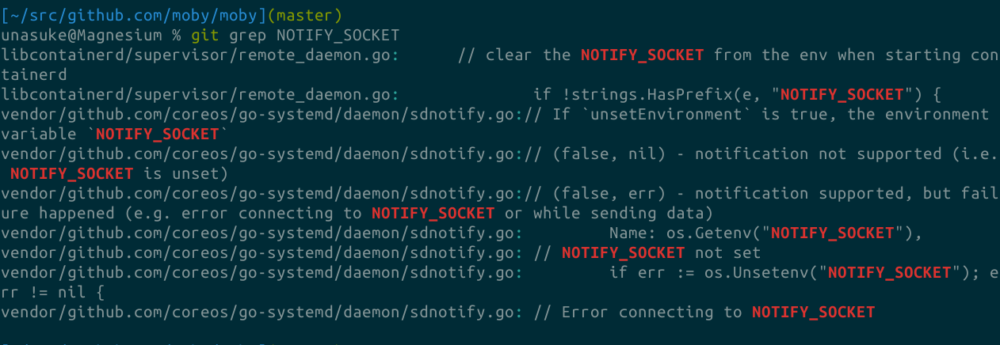
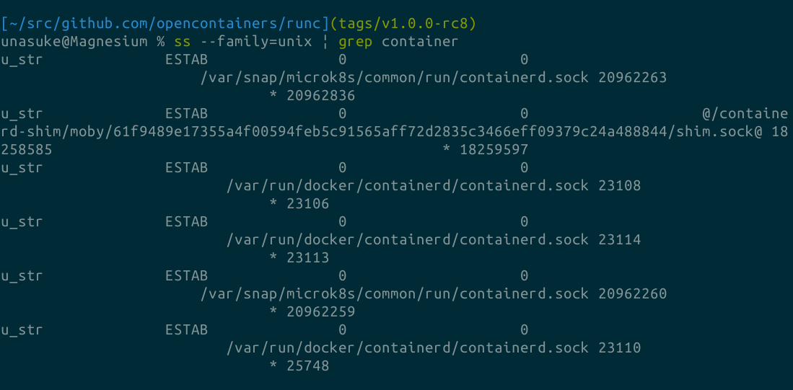
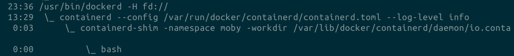

# NOTIFY_SOCKET\\n環境変数について
subtitle
: 2019-09-24

subtitle
: Container Runtime Meetup #1

author
: うなすけ

theme
: unasuke-white

# 自己紹介
- 名前 : うなすけ
- 仕事 : 株式会社バンク (業務委託)
  - インフラ寄りサーバーサイドエンジニア
  - Ruby, Rails, Kubernetes...

- {::tag name="x-small"}GitHub [@unasuke](https://github.com/unasuke){:/tag}
- {::tag name="x-small"}Mastodon [@unasuke@mstdn.unasuke.com](https://mstdn.unasuke.com/@unasuke){:/tag}
- {::tag name="x-small"}Twitter [@yu\_suke1994](https://twitter.com/yu_suke1994){:/tag}

{:relative_width="24" align="right" relative_margin_right="-10" relative_margin_top="42"}

# Excuse (僕の実力について)
- Railsでweb API を作ってて、「コンテナ？便利じゃん〜」くらいのレベルの開発者
- image-specは読んだことがあります
- @udzuraさんにそそのかされて来ました
  - <https://twitter.com/udzura/status/1166345876769394689>

{:relative_width="80"}

# 調査する対象を決めるまで
{:relative_width="90"}

<https://runtime.connpass.com/event/145088>

# 調査する対象を決めるまで
とりあえず最新リリースを読む対象にするじゃないですか

<https://github.com/opencontainers/runc/releases/tag/v1.0.0-rc8>

# 調査する対象を決めるまで
```go
status, err := startContainer(context, spec, CT_ACT_RUN, nil)
```
<https://github.com/opencontainers/runc/blob/v1.0.0-rc8/run.go#L76>

ああなんかこの辺でContainerが起動するんだな

# 調査する対象を決めるまで
```go
notifySocket := newNotifySocket(context, os.Getenv("NOTIFY_SOCKET"), id)
if notifySocket != nil {
	notifySocket.setupSpec(context, spec)
}
```
<https://github.com/opencontainers/runc/blob/v1.0.0-rc8/utils_linux.go#L411-L414>

`NOTIFY_SOCKET` ← これなに？

# 調査する対象を決めるまで
この時点での認識

> 「環境変数がある状態で起動させると色々な通知が飛んでくるのだろうか？」

# Dive into code
```go
func newNotifySocket(context *cli.Context, notifySocketHost string, id string) *notifySocket {
	if notifySocketHost == "" {
		return nil
	}

	root := filepath.Join(context.GlobalString("root"), id)
	path := filepath.Join(root, "notify.sock")

	notifySocket := &notifySocket{
		socket:     nil,
		host:       notifySocketHost,
		socketPath: path,
	}

	return notifySocket
}
```
`notifySocket`のインスタンスはここで生成される
<https://github.com/opencontainers/runc/blob/v1.0.0-rc8/notify_socket.go#L23-L38>

# Dive into code
```go
func newNotifySocket(context *cli.Context, notifySocketHost string, id string)
```

このcontext は <https://godoc.org/github.com/urfave/cli#Context> を指す

なので `/tmpfs/[container-id]/notify.sock` があるはず

# Dive into code
```go
func (s *notifySocket) setupSpec(context *cli.Context, spec *specs.Spec) {
  mount := specs.Mount{Destination: s.host, Source: s.socketPath, Options: []string{"bind"}}
  spec.Mounts = append(spec.Mounts, mount)
  spec.Process.Env = append(spec.Process.Env, fmt.Sprintf("NOTIFY_SOCKET=%s", s.host))
}
```
直後に`setupSpec`を呼んでいる
<https://github.com/opencontainers/runc/blob/v1.0.0-rc8/notify_socket.go#L44-L50>

# Dive into code
> If systemd is supporting sd_notify protocol, this function will add support for sd_notify protocol from within the container.

なるほどsystemd？

まあなんか色々やってるんだな (runtime-specのMountあたり)

# Dive into code
```go
func (s *notifySocket) setupSocket() error {
	addr := net.UnixAddr{
		Name: s.socketPath,
		Net:  "unixgram",
	}
```

`createContainer`後にsetupSocketが呼ばれる

<https://github.com/opencontainers/runc/blob/v1.0.0-rc8/notify_socket.go#L52-L56>

# Dive into code
<https://golang.org/pkg/net/#UnixAddr>

```go
type UnixAddr struct {
    Name string
    Net  string
}
```

`unixgram` ← datagram socket (UDP的な送りっぱなしのプロトコル)
<https://github.com/golang/go/blob/master/src/net/unixsock_posix.go#L16-L27>

# Dive into code
> ListenUnixgram acts like ListenPacket for Unix networks.
<https://golang.org/pkg/net/#ListenUnixgram>

connectionを張るっぽい

そして `runner` 構造体の `notifySocket` field に`notifySocket` 構造体のインスタンスが格納される

#  runner.run の中で……
```go
// Setting up IO is a two stage process. We need to modify process to deal
// with detaching containers, and then we get a tty after the container has
// started.
handler := newSignalHandler(r.enableSubreaper, r.notifySocket)
```

SignalHandlerを作成している
<https://github.com/opencontainers/runc/blob/v1.0.0-rc8/utils_linux.go#L305-L308>

# ここまで
- `NOTIFY_SOCKET` という環境変数をもとにsoket通信をしている？
- これは `unixgram` によって通信するもの
- systemd が何か関係しているようだ

# `NOTIFY_SOCKET` をググる
- <https://www.freedesktop.org/software/systemd/man/sd_notify.html#Notes>
- [sd_notifyの通信方法 - Qiita](https://qiita.com/ozaki-r/items/ced43d5e32af67c7ae04)
- [systemd(1) — Arch Linux マニュアルページ](https://man.kusakata.com/man/systemd.1.html)

# freedesktop.org
> These functions send a single datagram with the state string as payload to the AF_UNIX socket referenced in the $NOTIFY_SOCKET environment variable. If the first character of $NOTIFY_SOCKET is "@", the string is understood as Linux abstract namespace socket.

<https://www.freedesktop.org/software/systemd/man/sd_notify.html#Notes>

# sd_notifyの通信方法 - Qiita
> systemdのマネージャ(デーモンプロセス)は、起動プロセスの最後の方でsd_notifyという関数を用いて、起動が完了したことをsystemd本体(PID=1)に通知する。(注：sd_notifyは実際にはもっと汎用的なステータス通知に使える。)

<https://qiita.com/ozaki-r/items/ced43d5e32af67c7ae04>

# なるほどね
じゃあ、例えばDockerでも使われてるんだろうか？

# Dockerではどうか
<https://github.com/docker/cli> にはない

と思ったら <https://github.com/moby/moby> にはあった

# Dockerでの `NOTIFY_SOCKET`
`$ git grep NOTIFY_SOCKET`

{:relative_width="100"}

ある

# 手元のマシンでそれっぽいものが作成されているのか？
```shell
$ ss --family=unix | grep systemd | wc -l
110
```

👀

# 手元のマシンでそれっぽいものが作成されているのか？
`$ ss --family=unix | grep container`

{:relative_width="90"}

なんかおる

# 手元のマシンでそれっぽいものが作成されているのか？
`$ ps aux --forest`

{:relative_width="100"}

# 環境変数を覗いてみる
dockerdの環境変数

```shell
$ sudo cat /proc/601/environ
LANG=ja_JP.UTF-8
PATH=/usr/local/sbin:/usr/local/bin:/usr/bin:/var/lib/snapd/snap/bin
NOTIFY_SOCKET=/run/systemd/notify
LISTEN_PID=601
LISTEN_FDS=1
LISTEN_FDNAMES=docker.socket
INVOCATION_ID=e65738cc4b8f461e968d23c6740a557e
JOURNAL_STREAM=9:22835
```

# まとめと今後の目標
- `NOTIFY_SOCKET` でsystemdとやりとりしているようだ
- `dockerd` には `NOTIFY_SOCKET` が与えられていることが確認できた
- `runc run` を実行したときにもこれは与えられるのか？
- 実際にどのようなデータがどのようなタイミングで送られるのか？
  - dockerでは？ runcでは？他では？
